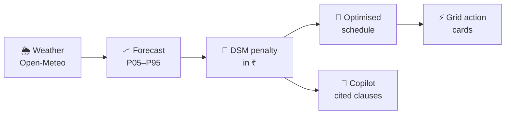

<div align="center">

# ⚡ VidyutVaani

### Turn renewable forecast uncertainty into the cheapest schedule a plant can submit.

Probabilistic generation forecasting and CERC deviation-penalty optimisation for Indian solar and wind plants.

[](https://ai-powered-renewable-generation-for.vercel.app/)

[](https://github.com/Meetvirugama/AI-Powered-Renewable-Generation-Forecasting-Platform/actions/workflows/ci.yml)


**[Live app](https://ai-powered-renewable-generation-for.vercel.app/)** ·
**[How it works](docs/system_architecture.md)** ·
**[Architecture at a glance](docs/architecture_diagram.md)** ·
**[Demo script](DEMO_SCRIPT.md)** ·
**[API contract](docs/openapi.json)**

</div>

---

## 🔗 Deployed link

**https://ai-powered-renewable-generation-for.vercel.app/**

The dashboard is served from Vercel and talks to the production API on Azure. If you see a
**FIXTURE DATA** badge in the status bar, that page is running on the built-in sample data instead.

---

## The problem

Every renewable plant in India submits a day-ahead schedule: how many megawatts it will inject
in each of the day's **96 fifteen-minute blocks**. When actual output drifts outside the tolerance
band, the plant pays a cash penalty under CERC's **Deviation Settlement Mechanism (DSM)**, block
by block.

Solar and wind are uncertain by nature, so most tools answer *"how much will we generate?"*
That is the wrong question to stop at. A plant loses money on the **gap** between what it promised
and what it delivered, and that cost is asymmetric. The question that matters is:

> **Given everything we don't know about tomorrow, which schedule costs the least?**

VidyutVaani is built around that question. Background: [Project understanding](docs/project_understanding.md) ·
[Why a point forecast is not enough](docs/project_understanding.md#why-a-point-forecast-is-not-enough) ·
[Regulatory context](docs/project_understanding.md#regulatory-context)

## What makes it different

Everyone forecasts. VidyutVaani adds the **decision layer** on top:

| Step | What happens | Deep dive |
|---|---|---|
| **1. Forecast a range** | P05 to P95 output for every block, 24 / 48 / 72 hours ahead. LightGBM for solar, a turbine power curve for wind | [Forecasting](docs/system_architecture.md#5-forecasting) |
| **2. Price it in ₹** | Expected penalty under the real CERC rules, with 2024, 2026 and 2031 rule sets side by side | [DSM pricing](docs/system_architecture.md#6-dsm-pricing) |
| **3. Optimise the schedule** | Picks the schedule with the lowest *expected* rupee penalty across the whole band, with optional battery storage | [Optimisation and storage](docs/system_architecture.md#7-schedule-optimisation-and-storage) |
| **4. Net across a portfolio** | Shows how much plants save by settling as a pool, with the correlation assumption declared | [Portfolio pooling](docs/system_architecture.md#8-portfolio-pooling) |
| **5. Act** | Curtailment, reserve and high-risk-block action cards, each with its rupee impact | [Architecture at a glance](docs/architecture_diagram.md) |
| **6. Explain** | A regulatory copilot that answers with cited CERC clauses | [Regulatory copilot](docs/system_architecture.md#9-regulatory-copilot) |



### 🛡️ The copilot cannot invent money

Every rupee figure on screen comes from the deterministic DSM engine, never from the language
model. After generation, a server-side guardrail strips any number the engine did not supply and
reports it on screen (`pass`, `numbers_stripped` or `fallback_template`).
See [where each rupee figure comes from](docs/architecture_diagram.md#where-each-rupee-figure-comes-from)
and the [guardrail contract](docs/api_rag_contract.md#metaguardrail).

## 📊 Results

Measured on the production system on **13 September 2026**. Full audit: [What we can honestly claim](docs/roadmap.md#what-you-can-honestly-claim-today).

| | Result |
|---|---|
| **Forecast skill vs. persistence** | **+21.5%** at 24 h · **+26.9%** at 48 h · **+32.5%** at 72 h |
| **Uncertainty band coverage** | **85.9%**, conformally calibrated |
| **Penalty saved by optimising** | **15.5%** for a 50 MW solar plant |
| **Penalty saved by pooling** | **25.6%** for a three-plant pool |
| **Copilot retrieval** | recall@5 = **0.73** over 179 chunks from 3 CERC documents |
| **Plants covered** | **101** real Gujarat plants |
| **Synthetic data in production** | **None**. `/health` reports `serving_synthetic_data: []` |

Savings are measured per day against a calibrated band, so they move with the weather.
Benchmark details: [Model benchmarking](docs/ml_pipeline.md#8-model-benchmarking).

## 🔬 Engineering we're proud of

- **Our own gate rejected our first models.** They had a 22× scale mismatch and predicted solar
  output at midnight. We removed the leaking features, retrained, and kept the gate.
  [The plausibility gate](docs/model_integration.md#the-plausibility-gate) ·
  [Why the original models could not serve](docs/model_integration.md#why-the-original-models-could-not-serve)
- **Calibrated uncertainty.** Raw quantile regression covered only 71.5% against a nominal 80%, so
  the band is widened conformally until it tells the truth.
- **Engines are swappable and honest about it.** Mock and production engines sit behind one
  factory, and the API reports which is serving. [Engine selection](docs/system_architecture.md#4-engine-selection)
- **Deploys that roll themselves back.** CI runs lint, tests and a Docker build with a
  vulnerability scan. The Azure deploy waits for a health check and reverts automatically if it
  fails. [CI/CD](docs/deployment_azure.md#cicd)
- **A fallback ladder for demo day.** The whole stack runs offline on a laptop through Docker.
  [The fallback ladder](docs/deployment.md#the-fallback-ladder) · [Runbook](docs/runbook.md#failure-modes)

## 🗺️ A tour of the dashboard

| Page | What you'll see |
|---|---|
| **Overview** | Expected penalty, savings from optimising, worst block, daily briefing, plant map |
| **Forecast** | P05–P95 fan chart with a 24 / 48 / 72-hour switch. The 24-hour view overlays the optimised schedule |
| **Risk** | A 96-block heatmap of expected penalty, and naive vs. optimised totals |
| **Actions** | Grid action cards, the battery capacity slider, and portfolio pooling |
| **DSM Copilot** | Questions about the rules, answered with citations |

## 🧱 Tech stack

| Layer | Technology |
|---|---|
| **Forecasting** | LightGBM quantile models with conformal calibration · IEC turbine power curve for wind |
| **Backend** | Python 3.11 · FastAPI · PostgreSQL with pgvector · Alembic |
| **Copilot** | LangGraph · LiteLLM (Groq, Gemini) · retrieval over CERC documents with a post-generation guardrail |
| **Frontend** | React 19 · TypeScript · Vite · Tailwind CSS v4 · ApexCharts · Leaflet |
| **Infrastructure** | Azure VM behind Caddy · Vercel · Docker · GitHub Actions · Trivy |

## 🚀 Quick start

Requires **Python 3.11+** and **Node 18+**. The default configuration runs entirely on sample
data, so no database or API keys are needed.

```bash
# 1. Backend  →  http://localhost:8000/docs
pip install -r requirements-dev.txt
cp .env.example .env
uvicorn backend.main:app --reload

# 2. Frontend (new terminal)  →  http://localhost:5173
cd frontend
cp .env.example .env        # sample-data mode; set VITE_USE_MOCKS=false to use the local API
npm install
npm run dev
```

**Or run the full stack with Docker:**

```bash
cp .env.example .env
docker compose --profile dev up     # PostgreSQL + API + frontend
```

More: [Frontend developer guide](docs/frontend_developer_guide.md) · [Mock mode](docs/frontend_developer_guide.md#mock-mode) · [Deployment](docs/deployment_azure.md)

## 🔌 API

Base URL in development: `http://localhost:8000`. Interactive docs at `/docs`.

| Method | Endpoint | Purpose |
|---|---|---|
| `GET` | `/dashboard/{plant_id}` | Everything the dashboard needs in one call |
| `GET` | `/forecast?plant_id&date&hours` | P05–P95 forecast for 24, 48 or 72 hours |
| `POST` | `/dsm` | Per-block penalty in ₹ for a schedule |
| `POST` | `/optimize` | Naive vs. optimised schedule, battery dispatch, action cards |
| `POST` | `/pooling` | Individual vs. pooled penalty with per-plant allocation |
| `POST` | `/rag/query` | Copilot answer with citations and guardrail status |
| `GET` | `/plants` · `/health` · `/rag/health` | Plant list, engine status, copilot status |

Full schema: [openapi.json](docs/openapi.json) · Copilot contract: [api_rag_contract.md](docs/api_rag_contract.md)

## 📁 Repository layout

```text
backend/          FastAPI app: forecasting, DSM engine, optimiser, pooling, copilot
frontend/         React dashboard (deployed on Vercel)
config/           DSM rule sets for 2024, 2026 and 2031, seed plants
regulations/      CERC source documents for the copilot
scripts/          Plant import, model training, index building, retrieval evaluation
tests/            pytest suite
infra/            Docker, AWS and Terraform
docs/             Architecture, ML, deployment and operations documentation
```

## 📚 Documentation

| Topic | Document |
|---|---|
| **Start here** | [Project understanding](docs/project_understanding.md) · [Architecture at a glance](docs/architecture_diagram.md) |
| **Design** | [System architecture](docs/system_architecture.md) · [Implementation plan](docs/implementation_plan.md) |
| **Machine learning** | [ML pipeline](docs/ml_pipeline.md) · [Model integration](docs/model_integration.md) |
| **APIs** | [OpenAPI schema](docs/openapi.json) · [Copilot API contract](docs/api_rag_contract.md) |
| **Frontend** | [Developer guide](docs/frontend_developer_guide.md) · [Implementation plan](docs/frontend_implementation_plan.md) |
| **Operations** | [Azure deployment](docs/deployment_azure.md) · [Docker and AWS](docs/deployment.md) · [Runbook](docs/runbook.md) |
| **Status** | [Roadmap](docs/roadmap.md) · [Demo script](DEMO_SCRIPT.md) |

## ⚠️ Known limitations

We state these up front:

- The solar model is trained on **one plant over 29.9 days** and applied to other plants by
  capacity-factor transfer, so accuracy beyond that plant is not yet verified.
- Wind forecasting is **physics only**. There is no wind generation data to validate it against.
- Imported plants have location and capacity but **no measured output**.
- Grid frequency defaults to **50 Hz**; all frequency tiers are implemented, but no live feed is connected.
- Copilot citations currently lean on the 2024 commentary document.

Full list: [Known limitations](docs/project_understanding.md#known-limitations)

## 🙏 Data and credits

Weather from [Open-Meteo](https://open-meteo.com/) · plant locations from
[OpenStreetMap](https://www.openstreetmap.org/copyright) (ODbL) and the
[WRI Global Power Plant Database](https://datasets.wri.org/dataset/globalpowerplantdatabase) (CC BY 4.0) ·
regulations from the [Central Electricity Regulatory Commission](https://cercind.gov.in/) ·
dashboard built on the [TailAdmin](https://github.com/TailAdmin/free-react-tailwind-admin-dashboard) React template (MIT).
Details: [Data sources](docs/project_understanding.md#data-sources)

## 👥 Team

| Member | Focus |
|---|---|
| **Meet Virugama** | Machine learning and DSM engine |
| **Gaurav Rathod** | Backend, API and data pipeline |
| **Shane Christian** | Frontend |
| **Madhav Thesiya** | Infrastructure and regulatory copilot |

<div align="center">

Built at **Hackout 2026** 🇮🇳

</div>
