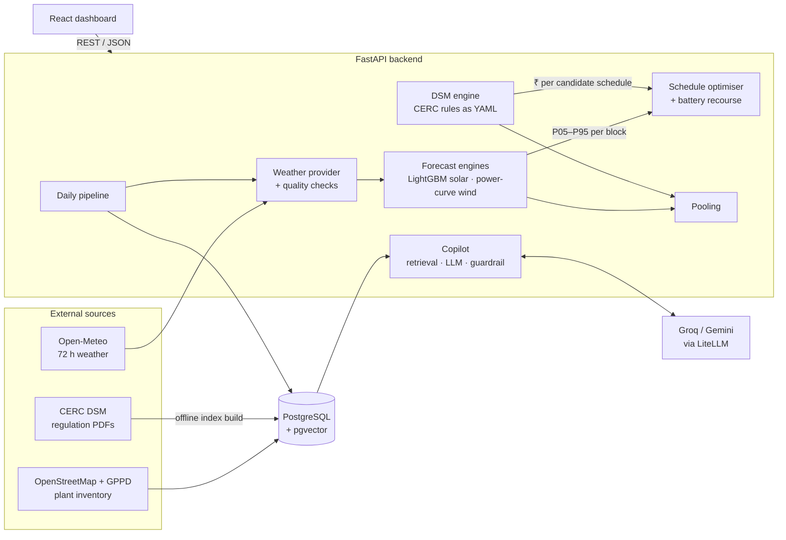
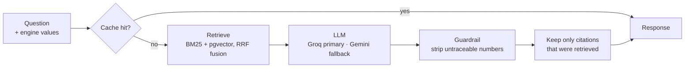
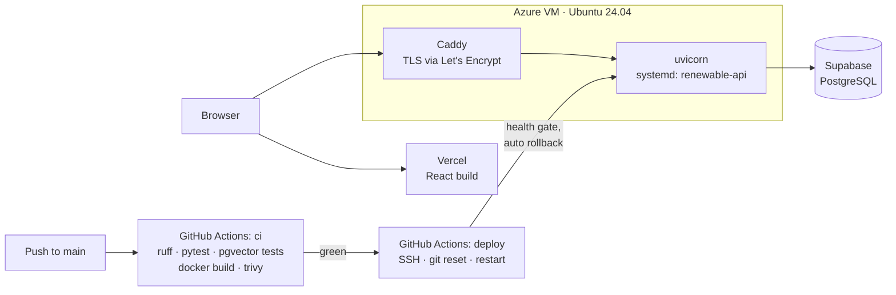

# GridMind

**Day-ahead scheduling for Indian renewable plants, priced against CERC deviation rules.**

[](https://github.com/Meetvirugama/AI-Powered-Renewable-Generation-Forecasting-Platform/actions/workflows/ci.yml)
[](https://github.com/Meetvirugama/AI-Powered-Renewable-Generation-Forecasting-Platform/actions/workflows/deploy.yml)


A solar or wind plant in India has to tell the grid operator, a day in advance, how much power
it will deliver in each of the next 96 fifteen-minute blocks. Under the CERC Deviation Settlement
Mechanism (DSM), every block that lands outside the permitted band costs the plant money.

Most tools stop at a forecast. GridMind carries the forecast through to the decision:

1. **Forecast** each block as a probability band (P05 to P95), not a single line.
2. **Price** that band in rupees under the CERC 2024, 2026 or 2031 rules.
3. **Optimise** the schedule the plant declares so the *expected* penalty is as low as possible.
4. **Flag actions**: curtailment, reserve and high-risk blocks, each with its rupee impact.
5. **Net** deviations across a portfolio of plants settled as a pool.
6. **Explain** any figure in plain language, citing the regulation it comes from.

The rule the whole system is built around: **every rupee figure comes from deterministic code.**
The language model explains numbers; a guardrail strips any number it tries to invent.

Built for Hackout 2026.

---

## Contents

- [What is real today](#what-is-real-today)
- [Architecture](#architecture)
- [How the pieces work](#how-the-pieces-work)
- [API](#api)
- [Running it locally](#running-it-locally)
- [Configuration](#configuration)
- [Deployment](#deployment)
- [Repository layout](#repository-layout)
- [Limitations](#limitations)
- [Documentation](#documentation)
- [Team](#team)

---

## What is real today

Checked against the running production API on 13 September 2026. `GET /health` reports
`serving_synthetic_data: []`, which means no engine in the chain is a mock.

| Capability | State | Evidence |
|---|---|---|
| Solar forecast | LightGBM quantile models, 24 / 48 / 72 h | Skill vs persistence: +21.5% / +26.9% / +32.5% |
| Forecast band | Conformally calibrated P10–P90 | Coverage 85.9% at 24 h (nominal 80%, 71.5% before calibration) |
| Wind forecast | Turbine power-curve physics, no ML | Hub-height wind from Open-Meteo |
| DSM pricing | CERC seller-side rules, X-trajectory, frequency tiers | YAML rule sets for 2024, 2026, 2031 |
| Schedule optimisation | Per-block search over [0, AvC] | GJ_SOLAR_A today: ₹12,650 → ₹10,685 (15.5% lower) |
| Portfolio pooling | Variance-based netting, correlation declared | GJ_POOL_1 today: ₹53,543 → ₹39,849 (25.6% lower) |
| Plant inventory | 101 real Gujarat plants (80 solar, 21 wind) | Imported from OpenStreetMap and GPPD |
| Regulatory copilot | BM25 retrieval over 3 CERC documents, guardrailed LLM | 179 chunks, recall@5 = 0.73 |
| Tests | Backend and frontend | 424 backend tests, frontend Vitest, lint-gated in CI |

Optimisation and pooling savings depend on the day's weather, so they move from day to day.
The figures above are one day's measurement, not a constant. They were also taken before PR #37,
which weights forecast quantiles by probability everywhere a penalty is computed and lowers
expected-penalty figures across the site, so expect different numbers once it deploys.

---

## Architecture



The backend is a single FastAPI service. Forecasting, pricing and optimisation run in-process;
nothing numeric is delegated to an external model. The only external calls in a request path
are Open-Meteo (cached for 15 minutes per plant and date) and, for copilot questions, the LLM.

### What happens when an operator opens the Risk page

```mermaid
sequenceDiagram
    autonumber
    participant UI as Dashboard
    participant API as FastAPI
    participant WX as Weather provider
    participant FC as Forecast engine
    participant OPT as Optimiser
    participant DSM as DSM engine

    UI->>API: POST /optimize {plant_id, date, rule_year}
    API->>WX: weather for plant and date
    WX-->>API: 72 h Open-Meteo (cached 15 min)
    API->>FC: generate_forecast(plant, weather)
    FC-->>API: 96 blocks, P05…P95 in MW
    loop each of 96 blocks
        OPT->>DSM: expected penalty for each candidate schedule
        DSM-->>OPT: ₹, probability-weighted over the quantiles
    end
    OPT-->>API: naive vs optimised ₹, schedule, action cards
    API-->>UI: JSON
```

A fuller treatment, including the data model and the pipeline, is in
[docs/system_architecture.md](docs/system_architecture.md).

---

## How the pieces work

### Forecasting

Solar plants are forecast by three LightGBM quantile models (P10, P50, P90) per horizon,
trained by [scripts/train_forecast.py](scripts/train_forecast.py) on 44 features: clock terms,
16 Open-Meteo weather variables, their lags, and generation from 96 blocks earlier. The target
is **capacity factor**, so one model serves plants of any size by scaling to each plant's
available capacity.

The raw P10–P90 band covered only 71.5% of held-out observations against a nominal 80%. A
conformal correction measured on a separate calibration split widens it to 85.9%. A band that
is narrower than it claims would understate penalty risk, which is the one direction an
operator must not be misled in. P05, P25, P75 and P95 are interpolated from the three trained
quantiles.

The first batch of trained models was rejected by the engine's own physics gate: they
predicted generation at midnight and were off in scale by 22×. They are kept in
`prediction_bundle/models/` as evidence, and a test asserts they are still rejected. The
models actually served are in `prediction_bundle/models_v2/`, with their feature order,
calibration delta, metrics and caveats recorded in `MANIFEST.json`.

Wind plants skip machine learning. Output follows the turbine power curve applied to
hub-height wind speed, and the uncertainty band comes from propagating wind-forecast error
through the curve's slope, so it is narrow when the turbine is flat out and wide on the ramp.

### DSM pricing

```
deviation % = 100 × (actual − schedule) / (X · AvC + (1 − X) · schedule)
```

Tolerance bands, the X-trajectory and the frequency multipliers live in
[config/dsm_rules_2024.yaml](config/dsm_rules_2024.yaml),
[2026](config/dsm_rules_2026.yaml) and [2031](config/dsm_rules_2031.yaml). A rule change is a
YAML change, not a retrain. Expected penalty weights each quantile by the probability mass it
represents, so P50 counts for far more than P05.

### Schedule optimisation and storage

Without a battery, nothing links one block to the next, so optimising each block on its own is
globally optimal. For every block the optimiser searches 201 candidate schedules between zero
and available capacity and keeps the one with the lowest expected penalty. The minimum often
sits between two forecast quantiles, which is why submitting P50 is rarely the cheapest choice.

A battery is modelled as real-time recourse: once a block's actual output is known, it absorbs
or covers the deviation back to the band edge, tracking its own state of charge along each
forecast path. A fixed day-ahead charge plan cannot lower a DSM penalty, because shifting
delivered output by a fixed amount is equivalent to declaring a different schedule. Responses
report `battery_modelled` and `battery_saving_inr` separately so the battery's contribution is
never folded into one total.

### Pooling

Plants in the same pool are settled on their net deviation, so errors in opposite directions
cancel. Medians add directly; spreads combine by variance addition with an assumed correlation
between plants. The assumption is returned in every response as `correlation_assumed`, because
it is an assumption, not a measurement.

A pool that mixes solar and wind has no single technology band, so it is priced against a
capacity-weighted band, returned as `tolerance_band_used`. A plant alone in its pool is reported
with `pool_size: 1` and settles individually.

### Regulatory copilot

A question goes through a linear LangGraph pipeline: cache lookup, hybrid retrieval, LLM
generation, guardrail, then citation validation.



- Any number in the answer that is not in the engine payload or a retrieved clause is replaced
  before the response leaves the server. `meta.guardrail` reports `numbers_stripped` when that
  happens.
- A citation to a clause the retriever never returned is dropped.
- If every provider is down, the copilot returns a deterministic template built from the engine
  values, with `meta.guardrail: fallback_template`.
- The regulation-year selector filters the corpus, so a 2024 view never cites a later document.
- Several API keys per provider can be configured; the router rotates on quota errors.

The live deployment runs retrieval on BM25 alone. The pgvector path is built and tested, but
dense embeddings are not loaded: recall@5 already clears its 0.70 target, and the remaining
misses are documents that are not in the corpus, which embeddings cannot fix.

---

## API

Interactive documentation is served at `/docs`. The schema is also committed as
[docs/openapi.json](docs/openapi.json).

| Method | Path | Returns |
|---|---|---|
| `GET` | `/health` | Liveness, which engines are active, `serving_synthetic_data` |
| `GET` | `/plants` | All plants with type, location, capacity and pool |
| `GET` | `/plants/{plant_id}` | One plant |
| `GET` | `/forecast?plant_id&date&hours` | P05–P95 per block for 24, 48 or 72 hours |
| `POST` | `/dsm` | Per-block penalty for a given schedule and rule year |
| `POST` | `/optimize` | Naive vs optimised cost, the schedule, battery dispatch, action cards |
| `POST` | `/pooling` | Individual vs pooled cost and per-plant allocation |
| `GET` | `/dashboard/{plant_id}?date` | Forecast, pricing, actions and pooling in one response |
| `POST` | `/rag/query` | Answer, citations, echoed engine values, guardrail status |
| `GET` | `/rag/health` | Corpus size, retrieval mode, usable LLM providers |
| `POST` | `/pipeline/run` | Starts the daily pipeline; returns `202` with a run id. Needs `X-API-Key` |
| `GET` | `/pipeline/status/{run_id}` | Status of a pipeline run |

Dates are `YYYY-MM-DD`. A malformed or impossible date returns `422`, as does a `/dsm` schedule
that is not exactly 96 non-negative values.

The copilot contract is specified in [docs/api_rag_contract.md](docs/api_rag_contract.md).

---

## Running it locally

**Backend** (Python 3.11 or newer):

```bash
git clone https://github.com/Meetvirugama/AI-Powered-Renewable-Generation-Forecasting-Platform.git
cd AI-Powered-Renewable-Generation-Forecasting-Platform

python -m venv .venv
source .venv/bin/activate            # Windows: .venv\Scripts\activate
pip install -r requirements-dev.txt

cp .env.example .env
uvicorn backend.main:app --reload    # http://localhost:8000/docs
```

`.env.example` starts every engine in `mock` mode, so this runs without a database, API keys or
network. To use SQLite instead of Postgres, set `DATABASE_URL=sqlite:///./local.db`.

**Full stack with Postgres and pgvector:**

```bash
docker compose up                    # add --profile dev to start the frontend too
```

**Frontend:**

```bash
cd frontend
cp .env.example .env                 # VITE_USE_MOCKS=true runs against local fixtures
npm install
npm run dev                          # http://localhost:5173
```

**Tests and lint:**

```bash
pytest tests/ -m "not slow"          # what CI runs
ruff check .
cd frontend && npm run test && npm run lint
```

**Building the regulation index** (only needed for the real copilot):

```bash
python scripts/build_index.py --dry-run     # check the chunker first
python scripts/build_index.py --truncate
python scripts/eval_retrieval.py --verbose  # recall@5 should stay above 0.70
```

---

## Configuration

Each engine is chosen by an environment variable. Setting one to `production` when the real
implementation cannot load is a startup error, not a silent fallback to mock data.

| Variable | Values | Effect |
|---|---|---|
| `FORECAST_ENGINE_TYPE` | `mock` · `production` | Seeded synthetic curve, or the LightGBM models. Wind always uses the power curve. |
| `OPTIMIZER_TYPE` | `mock` · `production` | Simplified stand-in, or the real per-block search |
| `RAG_COPILOT_TYPE` | `mock` · `production` | Canned answers, or retrieval, LLM and guardrail |
| `RAG_EMBED_BACKEND` | `bge` · `mock` | bge-m3 embeddings, or deterministic hash vectors for tests |
| `GROQ_API_KEYS`, `GEMINI_API_KEYS` | comma-separated | Several keys per provider enable rotation on rate limits |
| `DSM_RULE_CONFIG` | path | Default rule set |
| `CORS_ORIGINS` | comma-separated | Browser origins allowed to call the API |
| `PIPELINE_API_KEY` | string | Required header for `POST /pipeline/run` |

Every variable the application reads is listed, with notes, in [.env.example](.env.example).

---

## Deployment



- The API runs under systemd on an Azure VM, behind Caddy with an auto-renewing certificate.
- The frontend is a static build on Vercel.
- Every green build on `main` deploys itself. The deploy job pins the host key, reinstalls
  dependencies only when `requirements.txt` changed, waits up to two minutes for `/health`,
  and rolls back to the previous commit automatically if the new release does not come up.
- The Docker image is built and scanned on every push. It is the offline fallback
  (`docker compose up` on a laptop), not what production runs.

Operating notes are in [docs/deployment_azure.md](docs/deployment_azure.md) and
[docs/runbook.md](docs/runbook.md). A complete AWS path (EC2, RDS, CloudFront, EventBridge,
OIDC, Terraform) is kept in [infra/](infra/) and documented in
[docs/deployment.md](docs/deployment.md).

---

## Repository layout

```
backend/
  api/              route handlers, one module per resource
  core/             settings, plant resolution, date validation, auth
  data/             Open-Meteo and NASA POWER clients, validation, 15-min resampling
  db/               SQLAlchemy models, Alembic migrations, seed data
  modules/
    forecast/       LightGBM engine, feature builder, wind physics, weather provider
    dsm/            CERC DSM engine, rule loader, pooling
    optimize/       schedule optimiser, battery recourse
    rag/            ingestion, embeddings, retrieval, LLM routing, guardrail, copilot
    pipeline/       daily orchestration
    factory.py      picks mock or production engines, refuses silent fallback
  schemas/          Pydantic request and response models
config/             DSM rule sets (2024, 2026, 2031), seed plants, settings
frontend/           React 19 + TypeScript dashboard (Vite, Tailwind v4, ApexCharts, Leaflet)
prediction_bundle/  trained models, manifests, evaluation evidence
regulations/        CERC source PDFs and their metadata
scripts/            model training, index build, retrieval eval, plant import
infra/              Docker init, AWS provisioning scripts, Terraform
tests/              pytest suite
docs/               architecture, contracts, deployment, runbook, roadmap
```

---

## Limitations

These are stated here so nobody has to discover them.

- **The solar model is trained on one plant over 29.9 days.** Applying it to other plants is a
  capacity-factor transfer from a reference site, not a per-plant model, and the dataset is too
  short for rolling-origin cross-validation or seasonal claims.
- **Imported plants have no measured output.** OpenStreetMap and GPPD give location and
  capacity, not generation history, so forecasts for them cannot be validated against actuals.
- **Pool membership for imported plants is assigned, not official.** CERC pooling stations are
  not recorded in open data.
- **Grid frequency defaults to 50 Hz.** All five frequency tiers are implemented and `freq_hz`
  can be passed per request, but no live frequency feed is connected.
- **The copilot corpus is thin.** Three CERC documents, and most of the chunks are the Statement
  of Reasons rather than the operative regulation. The Grid Code (IEGC) is not yet indexed.
- **The 2026 DSM order is under legal challenge** in the Delhi High Court, which is why the
  2024 rules remain selectable.
- **The daily pipeline is triggered on demand.** The scheduled trigger exists for the AWS path
  (EventBridge); the Azure deployment has no scheduler yet, and pre-generated copilot briefings
  are not wired into the pipeline.
- **The platform recommends actions; it does not actuate anything.**

---

## Documentation

| Document | Covers |
|---|---|
| [System architecture](docs/system_architecture.md) | Components, request flow, pipeline, data model, design decisions |
| [Architecture diagrams](docs/architecture_diagram.md) | One-page visual map |
| [Project understanding](docs/project_understanding.md) | The problem and why the design is shaped this way |
| [ML pipeline](docs/ml_pipeline.md) | Data, features, training and evaluation |
| [Model integration](docs/model_integration.md) | Why the first models were rejected and what retraining changed |
| [RAG API contract](docs/api_rag_contract.md) | `/rag/query` request, response and rendering rules |
| [Frontend developer guide](docs/frontend_developer_guide.md) | Stack, tokens, hooks, components |
| [Azure deployment](docs/deployment_azure.md) | The live deployment and how to operate it |
| [AWS deployment](docs/deployment.md) | The alternative AWS path |
| [Runbook](docs/runbook.md) | Pre-flight checks, failure modes, rollback |
| [Roadmap](docs/roadmap.md) | What is left and in what order |
| [Demo script](DEMO_SCRIPT.md) | Three-minute walkthrough |

---

## Team

| | Name | Area |
|---|---|---|
| Member 1 | Meet Virugama | Forecasting models, DSM engine |
| Member 2 | Gaurav Rathod | Backend API, database, data pipeline |
| Member 3 | Shane Christian | Frontend dashboard |
| Member 4 | Madhav Thesiya | Infrastructure, deployment, regulatory copilot |

---

## Data and attribution

- Weather: [Open-Meteo](https://open-meteo.com/) (CC BY 4.0).
- Plant locations: © OpenStreetMap contributors (ODbL), and the WRI Global Power Plant Database.
- Regulations: Central Electricity Regulatory Commission, [cercind.gov.in](https://cercind.gov.in/).
