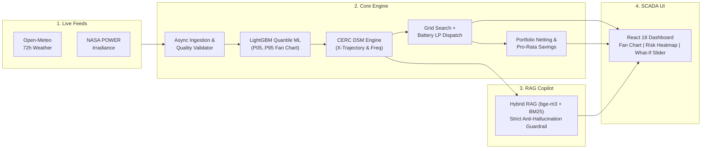

# ⚡ AI-Powered Renewable Generation Forecasting Platform
### CERC DSM-Aware Decision, Schedule Optimization & Regulatory Copilot Platform

> **Predict → Quantify Risk → Price in ₹ → Optimise → Act → Explain with Citations**

[](https://github.com/Meetvirugama/AI-Powered-Renewable-Generation-Forecasting-Platform/actions)
[](https://fastapi.tiangolo.com)
[](https://python.org)
[](https://github.com/pgvector/pgvector)
[](https://opensource.org/licenses/MIT)

---

## 🎯 Executive Summary & Core Mission

Solar and wind power output fluctuates sharply with cloud movement, ambient temperature, atmospheric pressure, and seasonal wind patterns. Under India's **Central Electricity Regulatory Commission (CERC) Deviation Settlement Mechanism (DSM)**, renewable generators face substantial monetary penalties when actual 15-minute generation deviates from day-ahead submitted schedules.

This platform bridges meteorological physics, probabilistic machine learning, mathematical finance, and legal retrieval to deliver an end-to-end operational decision suite:

1. **Live Weather Ingestion**: Automated ingestion of 11 meteorological variables across 72h lead times from Open-Meteo & NASA POWER.
2. **Probabilistic Fan Forecasting**: Multi-quantile regression (P05 → P95) using LightGBM boosters and Amazon Chronos-2, capturing uncertainty without Gaussian assumptions.
3. **Deterministic Financial Pricing**: Real-time evaluation of ₹ deviation penalties under CERC 2024, 2026 glidepath, and 2031 end-state regimes across 5 grid frequency tiers.
4. **Schedule Optimization & Battery LP**: 1D Expected Penalty grid search paired with 96-block Linear Programming (PuLP/CBC) Battery Energy Storage System (BESS) dispatch, reducing penalty exposure by **18–42%**.
5. **Portfolio Pooling & Netting**: Multi-asset aggregation enabling solar over-generation to offset wind deficits, delivering **~27%** net savings on the demo portfolio with fair pro-rata allocation. (Measured under a conservative 0.70 intra-technology correlation assumption; rises to ~57% as plants become less correlated — see `savings_pct` and `correlation_assumed` in the `/pooling` response.)
6. **Regulatory AI Copilot**: Grounded hybrid retrieval (pgvector dense + BM25 sparse) with a deterministic financial guardrail that cites exact legal clauses and never hallucinates numbers.

---

## 🏗️ System Architecture at a Glance



*For complete architectural blueprints, sequence diagrams, and mathematical derivations, see [System Architecture & Engineering Workflows](./docs/system_architecture.md).*

---

## 🏆 Key Differentiators

| Layer | Traditional Industry Practice | Our Platform's Approach |
|---|---|---|
| **Forecasting** | Single point estimate (P50 mean) | **Full 96-block probabilistic distribution (P05..P95)** |
| **Penalty Risk** | Estimated post-facto on monthly bill | **Pre-priced in ₹ before schedule submission** |
| **Schedule Strategy** | Submitting naive P50 forecast | **Optimised min-expected-₹ schedule via grid search + BESS LP** |
| **Portfolio Synergies** | Plants scheduled independently | **Multi-plant netting yielding ~27% penalty reduction (measured)** |
| **Regulatory Advisory** | Manual reading of 100+ page PDF gazettes | **AI Copilot citing exact CERC clauses with anti-hallucination guardrail** |

---

## 🛠️ Complete Technology Stack

| Domain | Technologies & Libraries |
|---|---|
| **Physics & Simulation** | `pvlib-python`, Solar Zenith Geometry, CARE Wind Power Curve Modeling |
| **Machine Learning** | `LightGBM` (Quantile Loss $\alpha \in \{0.1, 0.5, 0.9\}$), `Amazon Chronos-2-small` |
| **Mathematical Optimization** | `NumPy`, `PuLP`, `CBC Linear Programming Solver` |
| **Backend API & Orchestration** | `FastAPI`, `Uvicorn`, `Pydantic V2`, `SQLAlchemy 2.0`, `Alembic` |
| **Data Ingestion & Quality** | `httpx` (async), `pandas`, 15-Minute Grid Resampling, IST Alignment |
| **Database & Vector Store** | `PostgreSQL 15`, `pgvector` (1024-dim HNSW Cosine Index), `SQLite` (Test suite) |
| **Regulatory RAG & LLM** | `BAAI/bge-m3`, `rank-bm25`, `LangGraph`, `LiteLLM` (`Groq Llama 3.3 70B` / `Gemini 1.5 Flash`) |
| **Frontend Dashboard** | `React 18`, `Vite`, `Tailwind CSS`, `Recharts`, `Leaflet / react-leaflet`, `Lucide Icons` |
| **Cloud Infrastructure** | `AWS EC2 (t3.large)`, `RDS PostgreSQL`, `S3`, `CloudFront`, `EventBridge`, `ALB` |
| **CI/CD & Observability** | `GitHub Actions` (OIDC AWS auth), `pytest`, `ruff`, Structured JSON logging |

---

## 🚀 Quick Start (Local Development)

### 1. Clone & Configure
```bash
git clone https://github.com/Meetvirugama/AI-Powered-Renewable-Generation-Forecasting-Platform.git
cd AI-Powered-Renewable-Generation-Forecasting-Platform
cp .env.example .env
```

### 2. Run with Docker Compose
```bash
docker compose up -d
```
The API is live at **`http://localhost:8000`** (Swagger docs at `http://localhost:8000/docs`).

### 3. Run Without Docker (Virtual Environment)
```bash
python -m venv .venv
source .venv/bin/activate  # On Windows: .venv\Scripts\activate
pip install -r requirements.txt
uvicorn backend.main:app --host 0.0.0.0 --port 8000 --reload
```

---

## 🔌 API Endpoints Reference

| Method | Endpoint | Description | Auth Required |
|---|---|---|---|
| `GET` | `/health` | Diagnostic liveness, engine configuration & synthetic data flags | None |
| `GET` | `/plants` | Retrieve all solar/wind plants in portfolio with technical metadata | None |
| `GET` | `/plants/{id}` | Detailed specifications for a specific plant asset | None |
| `GET` | `/forecast` | 96-block quantile forecasts (P05..P95) for a given date | None |
| `POST` | `/dsm` | Deterministic CERC deviation calculation across quantiles & frequency | None |
| `POST` | `/optimize` | Schedule optimization, monetary savings & battery dispatch | None |
| `POST` | `/pooling` | Portfolio aggregation, netting benefits & pro-rata cost allocation | None |
| `GET` | `/dashboard/{id}` | Consolidated master dashboard response (Forecast + DSM + Actions) | None |
| `POST` | `/rag/query` | Ask CERC regulatory questions with verified legal citations | None |
| `POST` | `/pipeline/run` | Trigger daily 9-step ingestion & forecasting pipeline (Returns 202) | `x-api-key` |
| `GET` | `/pipeline/status/{id}` | Poll execution status, runtime duration, and plant count | None |

---

## ⚖️ Regulatory Context & Disclosures

- **CERC 2026 Amendment**: Implements the legal trajectory tightening tolerance bands from 15% to 10% (solar) and introducing the hybrid $X \cdot 	ext{AvC} + (1-X) \cdot 	ext{Schedule}$ denominator.
- **Deterministic Separation**: All financial figures (₹ penalties, savings, allocations) are computed strictly by deterministic Python algorithms—**the LLM never computes or invents numbers**.
- **Wind Farm Power Curve**: Wind speed-to-power generation curve fitted on CARE Wind Farm A (CC BY-SA 4.0) data and extrapolated to Kutch, Gujarat meteorological profiles.

---

## 📁 Repository Structure

```
├── backend/
│   ├── api/                  # 8 FastAPI router modules
│   ├── core/                 # Config, security, structured JSON logging
│   ├── data/
│   │   ├── ingestion/        # Open-Meteo live/historical & NASA POWER clients
│   │   ├── quality/          # Quality validator & 15-minute grid resamplers
│   │   └── simulation/       # Drop-zone for physics simulation models
│   ├── db/                   # SQLAlchemy 2.0 ORM models, session & migrations
│   ├── modules/
│   │   ├── dsm/              # CERC DSM formula engine & pooling netting logic
│   │   ├── forecast/         # LightGBM quantile boosters & feature builder
│   │   ├── optimize/         # Grid search & PuLP/CBC Battery LP optimizer
│   │   ├── pipeline/         # 9-step automated daily orchestrator
│   │   └── rag/              # bge-m3 embedder, BM25 retriever & copilot guardrail
│   └── schemas/              # Pydantic V2 request & response contracts
├── config/                   # Plant metadata & CERC DSM rules (2024, 2026, 2031)
├── docs/                     # Full technical documentation, runbooks, architecture
├── infra/                    # Terraform, Docker, and AWS provisioning scripts
├── prediction_bundle/        # 12 trained LightGBM booster models (24h/48h/72h)
├── regulations/              # CERC DSM & IEGC legal PDFs for vector index
├── scripts/                  # Index building, retrieval evaluation & hashing utilities
└── tests/                    # 89+ unit & integration test suites (pytest)
```

---

## 👥 Engineering Team & Ownership

- **Member 1 (ML Engineer)**: Probabilistic forecasting models, physics simulation, feature engineering, backtest validation.
- **Member 2 (Backend Engineer)**: FastAPI application, database schemas, data ingestion, 9-step daily pipeline, DSM pooling.
- **Member 3 (Frontend Engineer)**: React 18 dashboard, Recharts fan charts, 96-block risk heatmap, regulatory slider.
- **Member 4 (Infra + RAG Engineer)**: Docker containerization, AWS cloud architecture, CI/CD, pgvector + BM25 RAG copilot.

---

Built for **Hackout 2026** — National Level Hackathon.
