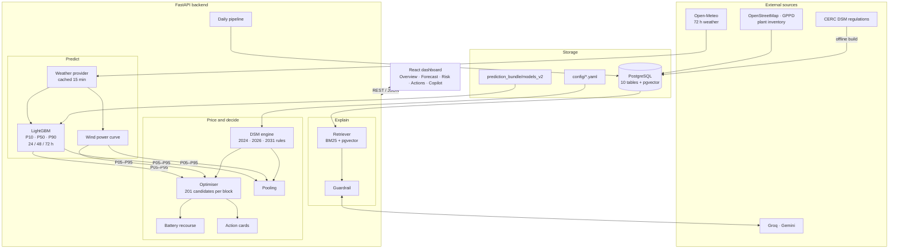
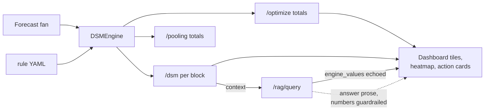
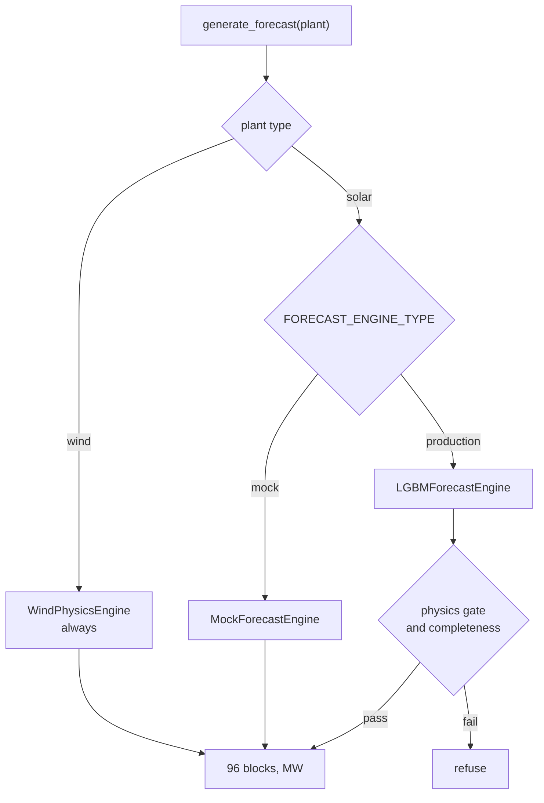
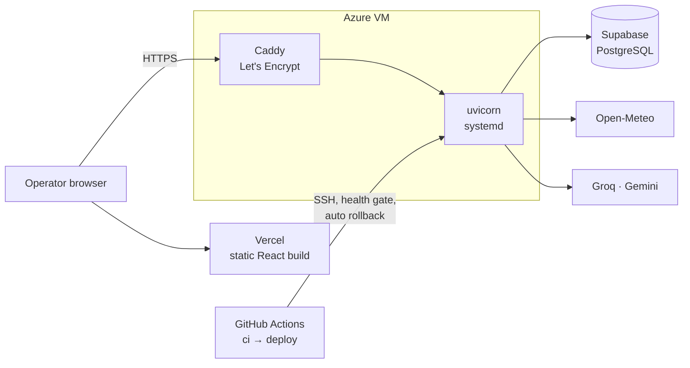

# GridMind — Architecture at a Glance

A one-page visual map. Each diagram is explained in
[system_architecture.md](system_architecture.md).

---

## The whole system

---

## Value chain

Everything in the lime-bordered steps is deterministic code. The blue step is the only place a
language model is involved, and it receives the figures rather than producing them.

---

## Where each rupee figure comes from

---

## Forecast engine routing

---

## Production deployment

An alternative AWS path (CloudFront, S3, ALB, EC2, RDS, EventBridge, CloudWatch) is kept in
`infra/aws/` and `infra/terraform/`.

---

## Seed portfolio

The four plants in `config/plants.yaml`, used by tests and offline demos. Production serves 101
imported Gujarat plants.

| Plant | Type | Capacity | Location | Pool |
|---|---|---|---|---|
| GJ_SOLAR_A | solar | 50 MW | near Gandhinagar (23.22, 72.64) | GJ_POOL_1 |
| GJ_SOLAR_B | solar | 75 MW | near Rajkot (22.30, 70.80) | GJ_POOL_1 |
| GJ_WIND_C | wind | 40 MW, 120 m hub | near Kutch (23.61, 68.98) | GJ_POOL_1 |
| GJ_SOLAR_D | solar | 30 MW, bifacial | near Palanpur (24.19, 72.43) | GJ_POOL_2 |

---

## One day in blocks

A day is 96 fifteen-minute blocks. Block 1 is 00:00–00:15 IST. Block numbers are derived from
the IST wall clock, not UTC, so block 1 is always local midnight.

| Blocks | IST | Typical solar exposure |
|---|---|---|
| 1–24 | 00:00–06:00 | none |
| 25–40 | 06:00–10:00 | ramp-up, high relative error |
| 41–64 | 10:00–16:00 | peak output, largest absolute ₹ exposure |
| 65–76 | 16:00–19:00 | ramp-down |
| 77–96 | 19:00–24:00 | none |
