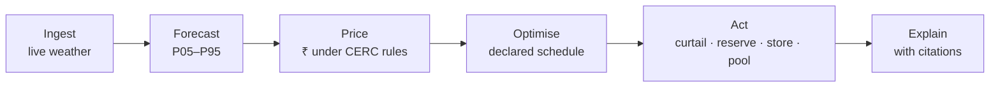

# Project Understanding

The problem VidyutVaani addresses, who it is for, and why the design looks the way it does. For
how it is built, see [system_architecture.md](system_architecture.md).

---

## The problem

Solar and wind output follows the weather, and the weather does not keep appointments. A
generator still has to commit, a day ahead, to how much power it will inject in each of 96
fifteen-minute blocks. When actual injection misses that commitment by more than the permitted
band, the Central Electricity Regulatory Commission's Deviation Settlement Mechanism (DSM)
charges the generator for it, block by block.

So the operational question is not "how much will the plant generate?" It is "what should the
plant declare, given that it does not know?" Those are different questions, and a point
forecast only answers the first.

---

## Who uses it

| User | Question they bring |
|---|---|
| Plant owner | What schedule should I declare, and what will deviation cost me? |
| Grid operator | Where in tomorrow's day is the imbalance risk concentrated? |
| Utility or aggregator | How much do I save by settling plants as a pool? |
| Energy trader | How wide is the uncertainty on this plant's output tomorrow? |

---

## Why a point forecast is not enough

| Operator's question | A single forecast line tells them |
|---|---|
| Which schedule minimises my cost? | Nothing. Every schedule near the line looks equally good. |
| What does being wrong cost? | Nothing. Megawatt error is not rupee cost, and the penalty is asymmetric around the band. |
| How much reserve should I hold? | Nothing about the downside. |
| Is storage worth dispatching? | Nothing. A battery's value comes from the spread, not the mean. |

VidyutVaani forecasts a distribution (P05 to P95), prices every point of that distribution under
the CERC rules, and chooses the schedule with the lowest *expected* cost. The optimal schedule is
frequently not the median forecast, and the gap between them is money.

---

## The chain

| Layer | What it does | Where |
|---|---|---|
| Ingest | Open-Meteo weather per plant, validated and resampled to 15-minute IST blocks | `backend/data/`, `forecast/weather_provider.py` |
| Forecast | LightGBM quantiles for solar, power-curve physics for wind | `backend/modules/forecast/` |
| Price | Deviation, tolerance band, frequency tier, ₹ per block | `backend/modules/dsm/engine.py` |
| Optimise | Minimum expected ₹ schedule, optional battery recourse | `backend/modules/optimize/` |
| Act | Action cards and portfolio pooling | `optimize/`, `dsm/pooling.py` |
| Explain | Retrieval over CERC regulations, guardrailed LLM | `backend/modules/rag/` |

The boundary between pricing and explaining is the most important line in the system.
Everything up to "Act" is deterministic code. The explanation layer receives the numbers and is
structurally prevented from producing new ones.

---

## Regulatory context

The DSM framework is in force. The 2024 principal regulations define the deviation formula,
tolerance bands and normal rate of charges. A 2026 amendment introduces an X-trajectory that
moves the deviation denominator from available capacity toward the declared schedule between
2026 and 2031, and narrows the bands as it goes.

The 2026 order is under challenge in the Delhi High Court. VidyutVaani keeps 2024, 2026 and 2031
rule sets side by side for that reason, and because comparing them shows a plant what the
tightening will cost before it arrives.

---

## Design principles

| Principle | Consequence |
|---|---|
| Decision first | Components exist because they change a decision, not because they are interesting to build |
| Uncertainty is carried, not summarised | The quantile fan reaches pricing, optimisation and pooling intact |
| Money is computed, never generated | The copilot cannot originate a ₹ figure; a guardrail enforces it after generation |
| Refuse rather than degrade | A broken production engine stops the service; `/health` reports synthetic engines |
| Rules are configuration | Regulation changes are YAML edits |
| State limits before someone finds them | Caveats live in model manifests, API responses and the README |

---

## How the build differed from the original plan

The original plan is preserved in [implementation_plan.md](implementation_plan.md). Several parts
changed once they met real data, and the changes are worth knowing.

| Planned | Built | Why |
|---|---|---|
| LightGBM trained with every available feature | Retrained on 44 features, capacity-factor target | The first models used three features measured at the same instant as the target; the physics gate rejected them |
| 19 trained quantiles | 3 trained (P10, P50, P90), conformally calibrated, 4 interpolated | Raw bands under-covered (71.5% vs 80%); calibration mattered more than more quantiles |
| LightGBM for every plant | Power-curve physics for wind | A model trained on solar produces a noon-peaked curve for a turbine |
| Chronos-2 foundation model | Not built | Not needed for any claim the platform makes |
| 96-block battery LP (PuLP) | Battery as real-time recourse | A fixed day-ahead plan cannot lower a DSM penalty; it is equivalent to declaring a different schedule |
| Pooling by summing quantiles | Variance addition with declared correlation | Summing quantiles assumes perfect correlation and made pooling look harmful |
| AWS (CloudFront, EC2, RDS) | Azure VM, Vercel, Supabase | Where credits and time were; the AWS path is kept in `infra/` |
| Hybrid dense + sparse retrieval in production | BM25 only in production | Recall target met without embeddings; the misses are missing documents |
| Four invented demo plants | 101 real Gujarat plants from open data | A dashboard of real plants is a stronger and more honest claim |

---

## Data sources

| Source | Used for | Mode |
|---|---|---|
| Open-Meteo forecast API | Weather features for every forecast | Live |
| Indian solar plant generation dataset | Training the solar model (one plant, 29.9 days) | Offline |
| OpenStreetMap, Global Power Plant Database | Plant locations and capacities | Offline import |
| CERC regulations | Copilot corpus | Offline index build |
| NASA POWER | Historical irradiance client, available for training work | Offline |

---

## Known limitations

- The solar model is trained on one plant over 29.9 days and transferred to others by capacity
  factor. Seasonal and per-plant accuracy claims are not supported by that data.
- Imported plants have location and capacity but no measured generation, so their forecasts
  cannot be validated against actuals.
- Pool membership for imported plants is assigned for demonstration; real pooling stations are not
  in open data.
- No live grid frequency feed; pricing defaults to 50 Hz unless a caller passes `freq_hz`.
- The copilot corpus is three CERC documents and does not yet include the Indian Electricity Grid
  Code.
- The platform recommends actions. It does not dispatch storage, curtail output or call reserves.
- No demand data, so no net-load forecasting.
