# System Architecture

How GridMind is put together, why it is shaped the way it is, and where each decision lives in
the code. For a one-page visual map, see [architecture_diagram.md](architecture_diagram.md).

Last verified against `main` and the production API on 13 September 2026.

---

## Contents

1. [Design principles](#1-design-principles)
2. [Components](#2-components)
3. [Request flow](#3-request-flow)
4. [Engine selection](#4-engine-selection)
5. [Forecasting](#5-forecasting)
6. [DSM pricing](#6-dsm-pricing)
7. [Schedule optimisation and storage](#7-schedule-optimisation-and-storage)
8. [Portfolio pooling](#8-portfolio-pooling)
9. [Regulatory copilot](#9-regulatory-copilot)
10. [Daily pipeline](#10-daily-pipeline)
11. [Data model](#11-data-model)
12. [Frontend](#12-frontend)
13. [Deployment and CI/CD](#13-deployment-and-cicd)

---

## 1. Design principles

Four rules shaped most of the decisions below.

| Principle | What it means in practice |
|---|---|
| Money is computed, never generated | Every ₹ figure comes from the DSM engine. The copilot receives those figures as input and a post-generation guardrail removes any number it cannot trace. |
| Uncertainty travels with the forecast | The quantile fan is carried into pricing, optimisation and pooling. Nothing downstream collapses it to a point estimate. |
| Refuse rather than degrade silently | A misconfigured production engine stops the service at startup. `/health` publishes which engines are synthetic. |
| Rules are data | CERC parameters live in YAML. A regulation change is a config change, not a retrain or a redeploy of models. |

---

## 2. Components

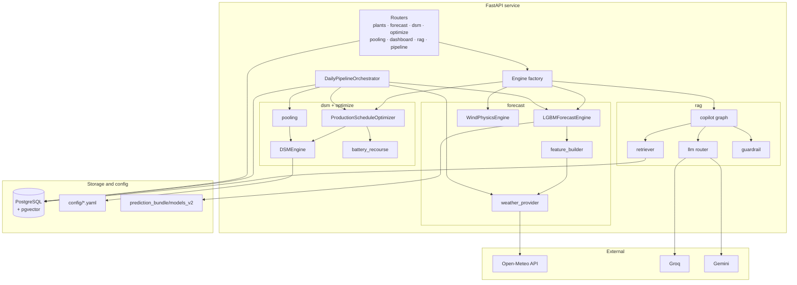

| Module | Path | Responsibility |
|---|---|---|
| Routers | `backend/api/` | HTTP boundary, request validation, response shaping |
| Factory | `backend/modules/factory.py` | Chooses mock or production engines; refuses silent fallback |
| Plant resolution | `backend/core/plants.py` | One lookup for every route: database first, YAML second |
| Weather provider | `backend/modules/forecast/weather_provider.py` | Fetches and caches Open-Meteo per plant and date |
| Forecast engines | `backend/modules/forecast/` | LightGBM for solar, power-curve physics for wind |
| DSM engine | `backend/modules/dsm/engine.py` | Deviation, band, frequency tier, ₹ per block |
| Optimiser | `backend/modules/optimize/schedule_optimizer.py` | Minimum expected ₹ schedule |
| Battery | `backend/modules/optimize/battery_recourse.py` | Storage as real-time recourse |
| Pooling | `backend/modules/dsm/pooling.py` | Net deviation across a pool |
| Copilot | `backend/modules/rag/` | Retrieval, LLM routing, guardrail, citations |
| Pipeline | `backend/modules/pipeline/daily.py` | Batch run over all plants |

---

## 3. Request flow

The dashboard calls the granular endpoints directly. `GET /dashboard/{plant_id}` returns the
same data in one response and is used by the pipeline and for integration.

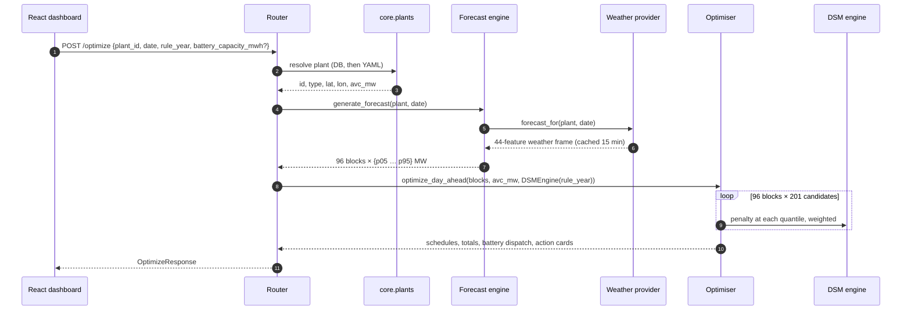

Two things keep this fast enough to run per request: the problem separates by block, and
LightGBM inference over 96 rows takes milliseconds. The slowest step is the Open-Meteo call,
which is cached.

Input is validated at the boundary. Dates must be real `YYYY-MM-DD` calendar dates, `/dsm`
requires exactly 96 finite, non-negative schedule values, and a negative battery size is
rejected. Each returns `422` rather than a `500` or a silently padded result.

---

## 4. Engine selection

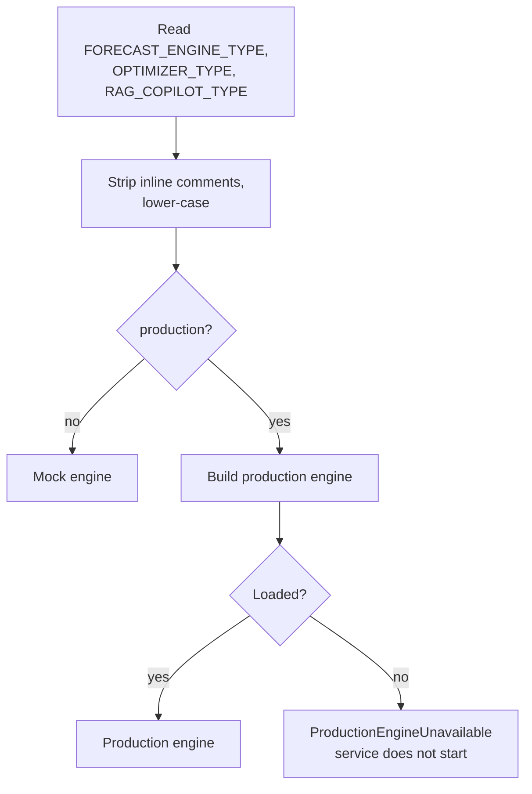

The fatal path is deliberate. A mock forecast priced by the real DSM engine produces
real-looking rupee figures with nothing on screen to distinguish them. `GET /health` lists the
active mode of each engine and a `serving_synthetic_data` array, so the question "are these
numbers real?" is answered by the API itself.

Comment stripping exists because systemd's `EnvironmentFile=` passes `mock  # mock | production`
through verbatim, while python-dotenv does not. The same `.env` behaved differently locally and
in production until the factory normalised it.

Wind plants are always routed to the physics engine, whatever `FORECAST_ENGINE_TYPE` says.
The LightGBM models learned an irradiance-shaped curve and would produce a solar bell curve for
a turbine.

---

## 5. Forecasting

### Solar

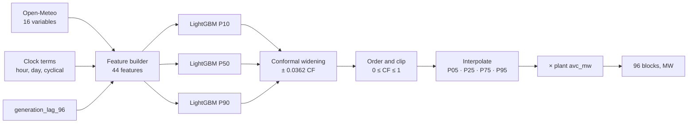

| | 24 h | 48 h | 72 h |
|---|---|---|---|
| MAE (capacity factor) | 0.0552 | 0.0575 | 0.0575 |
| Persistence MAE | 0.0704 | 0.0787 | 0.0852 |
| Skill vs persistence | +21.5% | +26.9% | +32.5% |
| P10–P90 coverage | 85.9% | 86.8% | 86.8% |

Source: `prediction_bundle/models_v2/MANIFEST.json`. Chronological 60/20/20 split, never
shuffled. The 48 h and 72 h models drop generation lags that would not exist at issue time.

**Target.** Capacity factor, AC output divided by capacity. This is what lets one model forecast
any plant, and it is also the main caveat: the model is trained on a single reference plant and
transferred.

**Excluded features.** `DC_POWER`, `DAILY_YIELD` and `TOTAL_YIELD` are measured at the same
instant as the target and cannot be known for a future block. The first model bundle used them;
see [model_integration.md](model_integration.md).

**Plausibility gate.** Before serving, the engine checks forecasts are non-negative, within
capacity, correctly ordered and near zero at night. It refuses to load models that fail.

**Completeness.** Missing features are left as NaN, not zero-filled, and every response
reports which features were unknown.

### Wind

`WindPhysicsEngine` applies a turbine power curve to hub-height wind speed. Between cut-in and
rated speed, output follows a cubic fitted to reach rated power at rated speed; above rated it
is flat; above cut-out it is zero. Wind speed arrives in km/h from Open-Meteo and is converted
to m/s before the curve.

Uncertainty is propagated rather than learned: σ_P ≈ |dP/du| × σ_u, with σ_u growing with lead
time. The band is narrow when the turbine is saturated and wide on the ramp.

---

## 6. DSM pricing

### Deviation

```
deviation % = 100 × (actual − schedule) / (X · AvC + (1 − X) · schedule)
```

X falls from 1.0 to 0.0 between 2026 and 2031, moving the denominator from available capacity
toward the schedule itself. That tightens the effective band for plants that under-declare.

### Rule sets

| Rule year | X | Solar band | Wind band | Notes |
|---|---|---|---|---|
| 2024 | 1.00 | ±15% | ±15% | Principal regulations |
| 2026-04-01 | 1.00 | ±10% | ±15% | Amendment; under legal challenge |
| 2026-10-01 | 0.90 | ±10% | ±15% | |
| 2027-10-01 | 0.75 | ±8% | ±12% | |
| 2028-10-01 | 0.55 | ±7% | ±11% | |
| 2030-10-01 | 0.30 | ±6% | ±10% | |
| 2031-04-01 | 0.00 | ±5% | ±10% | End state |

The trajectory is resolved by date inside `config/dsm_rules_2026.yaml`.

### Frequency multipliers

| Grid frequency | Over-injection | Under-injection |
|---|---|---|
| below 49.90 Hz | 2.0× | 2.0× |
| 49.90 – 49.95 Hz | 1.5× | 1.5× |
| 49.95 – 50.03 Hz | 1.0× | 1.0× |
| 50.03 – 50.05 Hz | 0.75× | 0.75× |
| 50.05 Hz and above | 0× (unpaid) | 1.0× |

`/dsm`, `/optimize` and `/pooling` accept `freq_hz` (default 50.0). No live frequency feed is
connected, so unless a caller supplies one, blocks are priced in the 1.0× tier.

### Penalty and expectation

A block inside the band costs nothing. Outside it, the charge is the deviation energy
(MW × 0.25 h) × normal rate of charges (default ₹450/MWh) × frequency multiplier.

Expected penalty is a probability-weighted sum over the seven quantiles, each weighted by the
probability mass it represents (midpoint rule). An unweighted average would triple the
influence of the tails.

---

## 7. Schedule optimisation and storage

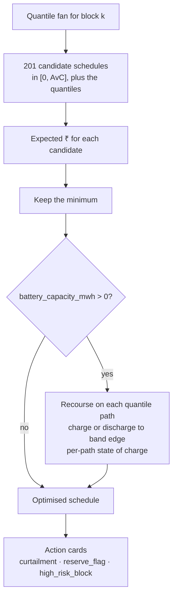

**Why per block.** With no storage, nothing couples one block's penalty to another's, so
independent optimisation is the global optimum, not an approximation.

**Why a fine grid.** The penalty curve is piecewise linear with kinks at the band edges. Its
minimum often lies between quantiles, so searching only quantile values systematically misses it.

**Why recourse, not a day-ahead battery plan.** Shifting delivered output by a fixed amount is,
to a DSM penalty, identical to declaring a different schedule, and the optimiser already searches
every schedule. An earlier fixed-plan LP dispatched hundreds of MWh and saved nothing. The
battery's value comes from reacting to the actual outcome.

**Why per-path state of charge.** A single expected state of charge let high and low outcomes
cancel, so the modelled battery never filled or emptied and appeared to remove the entire
penalty. Tracking each quantile path separately lets a battery run dry on a cloudy day, as a real
one does.

The response carries `optimised_without_battery_inr` and `battery_saving_inr`, so storage is
never credited with savings the schedule search found.

---

## 8. Portfolio pooling

```
pooled median  = Σ median_i
σ_pool         = √( Σ σ_i² + 2ρ · Σ_{i<j} σ_i σ_j )
```

Medians add regardless of correlation. Spreads do not: at ρ = 1 the pool is no better than its
members, and at ρ = 0 the spread shrinks roughly with √N.

An earlier version summed the same quantile across plants, which silently assumed perfect
correlation and made pooling look harmful (−11.5%). Correlation is not measured, because no
concurrent generation history exists for the plants, so the assumed values are returned in
`correlation_assumed` and can be overridden with `POOL_CORRELATION_SAME_TYPE` and
`POOL_CORRELATION_CROSS_TYPE`.

A pool that mixes solar and wind has no single technology band. It is priced against each plant's
band weighted by capacity, returned as `tolerance_band_used`; taking the dominant technology's
band instead let solar output settle on the wider wind band. Pools created by
`import_plants.py --cluster-pools` are grouped by technology as well as location, and every
pooling response carries `pool_size`, so a plant alone in its pool is not presented as a pool.

---

## 9. Regulatory copilot

### Offline: building the corpus

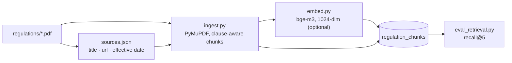

Chunks are split on regulation and paragraph headings first, then size-bounded inside a clause,
so a chunk never spans two clauses and its citation is always the clause it came from. Each row
stores `chunk_id` (idempotent re-ingest) and `embed_model`. At startup the service refuses to
serve if the stored embedding model differs from the one it would query with; a mismatch
otherwise returns confident, unrelated citations without raising anything.

### Online: answering a question

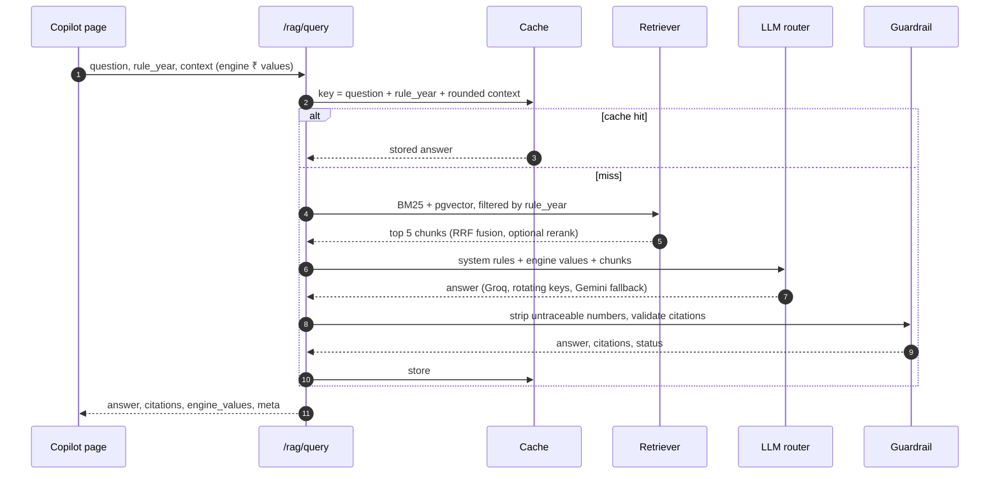

| Safeguard | Mechanism |
|---|---|
| No invented money | Every number in the answer must appear in the engine payload or a retrieved chunk; others are replaced and `meta.guardrail` becomes `numbers_stripped` |
| No invented citations | Citations are kept only if they match a retrieved chunk |
| Figures render from data, not prose | `engine_values` is an echo of the request, and the UI renders ₹ from it |
| Year consistency | Documents dated after the selected rule year are excluded from retrieval |
| Provider outage | Rotate keys on quota errors, fall back to Gemini, then to a deterministic template (`fallback_template`) |
| Reproducibility | Temperature 0.1, one-hour response cache |

**Live configuration.** Primary model `groq/openai/gpt-oss-120b`, fallback
`gemini/gemini-3.6-flash`. Retrieval runs on BM25 only over 179 chunks from three CERC documents;
dense embeddings are supported but not loaded in production. Measured recall@5 is 0.73 against a
0.70 target.

---

## 10. Daily pipeline

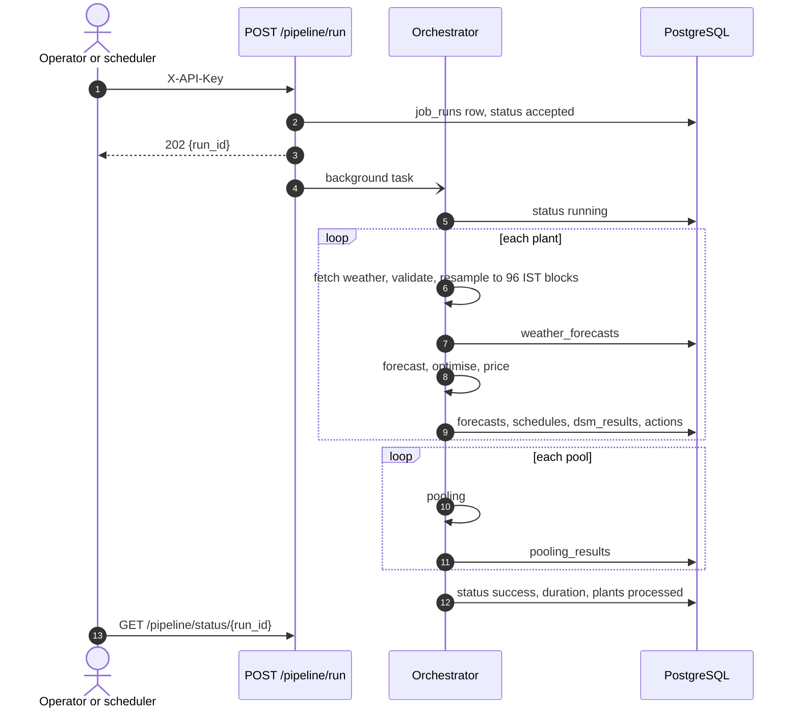

The endpoint returns immediately because a synchronous run would outlast any scheduler's HTTP
timeout. Block numbers are derived from the IST wall clock: block 1 is 00:00–00:15 IST.

**Current gaps.** The Azure deployment has no scheduler; a nightly trigger exists only in the AWS
path (EventBridge calling a Lambda). `copilot.generate_briefing()` exists but is not yet called by
the pipeline.

---

## 11. Data model

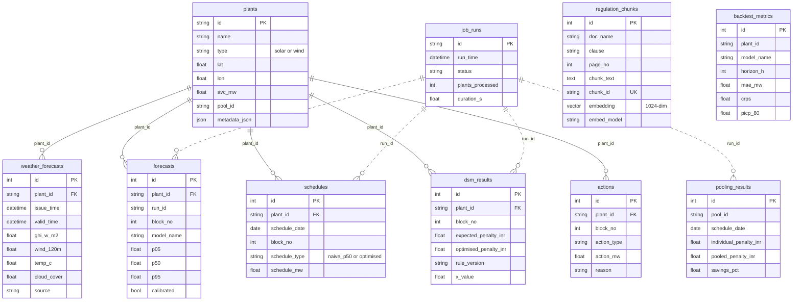

`run_id` columns are plain strings rather than foreign keys, shown dotted. Migrations are in
`backend/db/migrations/versions/`; the pgvector migration creates the `vector` extension and an
HNSW cosine index (HNSW rather than ivfflat, which clusters on whatever rows exist when the index
is built and loses recall when created on an empty table).

**Plants.** `config/plants.yaml` holds four seed plants so tests and a laptop demo work without a
database. Production holds 101 real Gujarat plants imported from OpenStreetMap and the Global Power
Plant Database by `scripts/import_plants.py`. Every route resolves plants through
`backend/core/plants.py`, database first.

---

## 12. Frontend

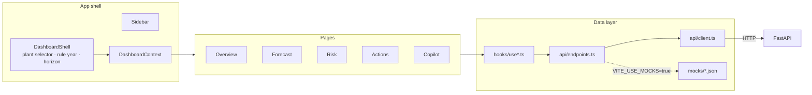

| Page | Shows |
|---|---|
| Overview | Stat tiles, briefing, plant map |
| Forecast | Fan chart with P05–P95 bands and optimised schedule, 24 / 48 / 72 h switch |
| Risk | 96-block penalty heatmap, naive vs optimised comparison |
| Actions | Action cards, battery size slider, pooling toggle |
| Copilot | Chat with citation badges and guardrail status |
| Not Found | Any unknown route, rendered inside the app layout |

Stack: React 19, TypeScript 5.7, Vite 6, Tailwind CSS v4, react-router 7, ApexCharts 4,
react-leaflet 5. Components never import axios; they read hooks. Full detail in
[frontend_developer_guide.md](frontend_developer_guide.md).

---

## 13. Deployment and CI/CD

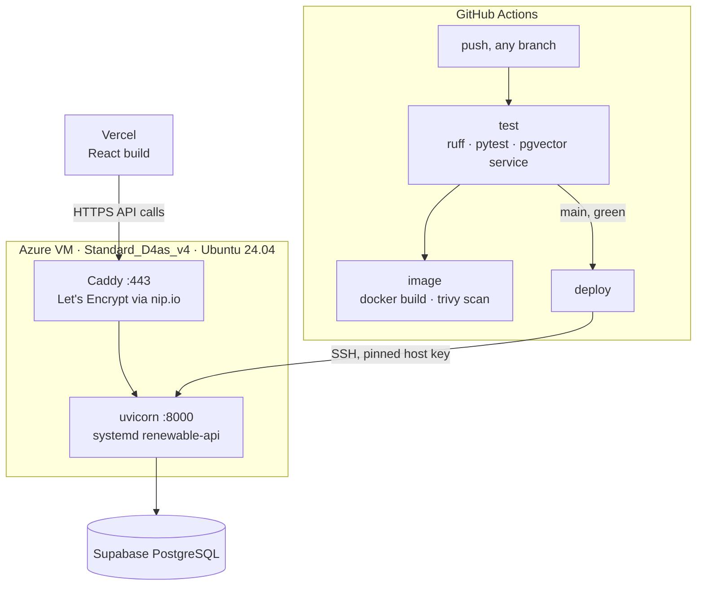

The deploy job records the current commit, resets to `origin/main`, reinstalls dependencies only
if `requirements.txt` changed, restarts the service, waits up to two minutes for `/health`, and on
failure resets to the recorded commit and prints the failed release's logs.

`nip.io` exists because Let's Encrypt cannot issue a certificate for a bare IP, and the HTTPS
frontend cannot call an HTTP API without the browser blocking it as mixed content.

The Docker image is built and scanned on every push but is not what production runs; it is the
laptop fallback. A complete AWS deployment (CloudFront, ALB, EC2, RDS, EventBridge, CloudWatch,
OIDC, Terraform) is kept under `infra/` and described in [deployment.md](deployment.md).
