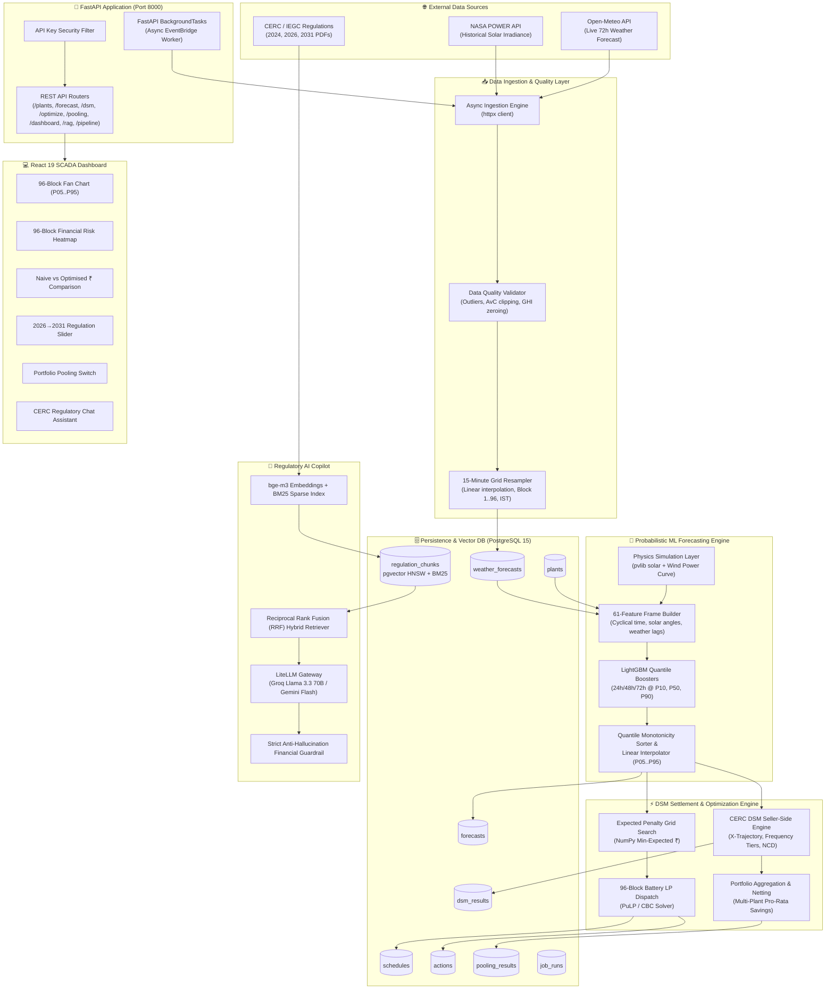
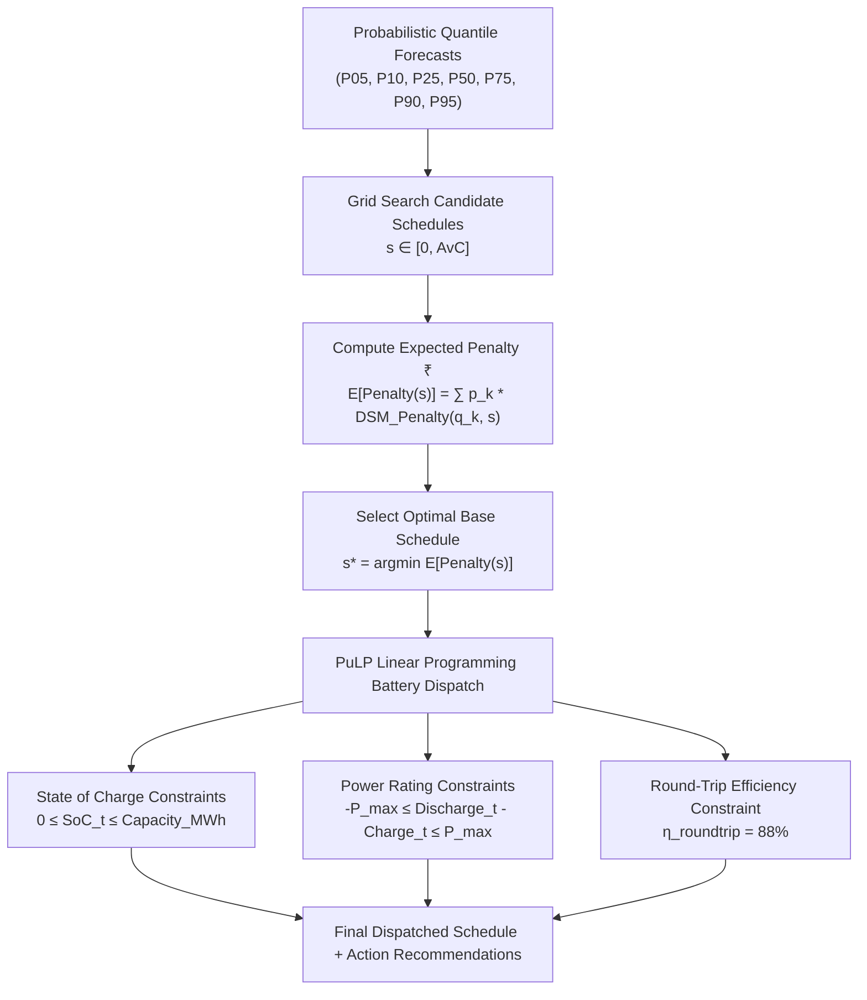
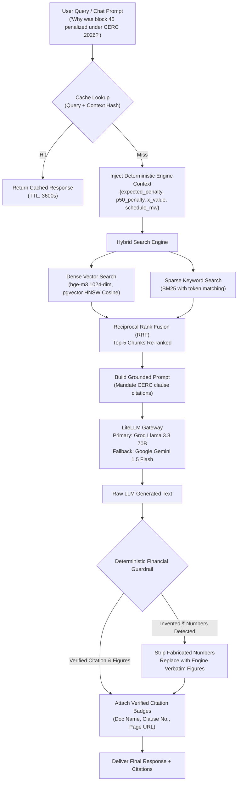
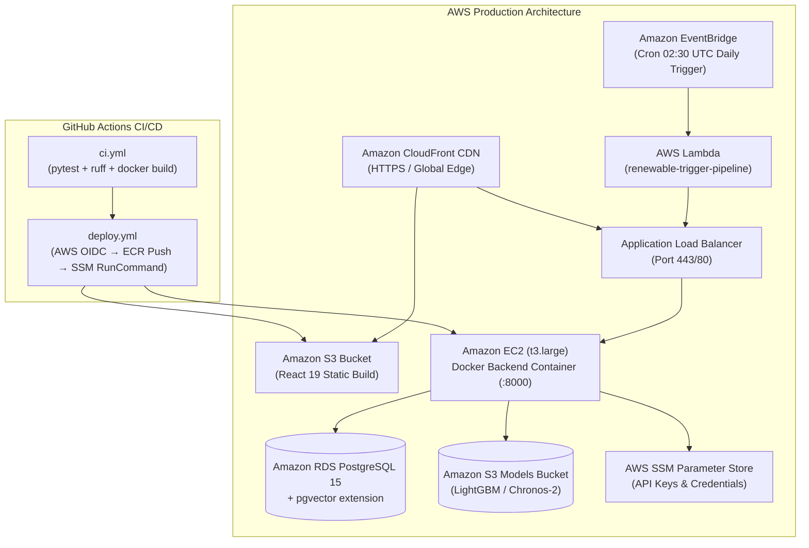

# 🏗️ System Architecture & Engineering Workflows

## AI-Powered Renewable Generation Forecasting & DSM Optimization Platform

---

## 1. High-Level System Architecture

The platform is designed around a multi-tier, decoupled architecture comprising **Data Ingestion**, **ML Forecasting**, **Deterministic DSM Settlement**, **Linear Programming Schedule Optimization**, **Hybrid Regulatory RAG Copilot**, and a **Real-Time Operational SCADA UI**.



---

## 2. End-to-End 9-Step Daily Orchestration Pipeline

The daily pipeline executes automatically at **02:30 UTC (08:00 IST)** via AWS EventBridge to prepare schedules before the SLDC/RLDC day-ahead submission cutoff.

```mermaid
sequenceDiagram
    autonumber
    actor Trigger as EventBridge / Admin
    participant API as FastAPI /pipeline/run
    participant Orch as DailyPipelineOrchestrator
    participant Weather as Open-Meteo API
    participant Quality as Quality Validator & Resampler
    participant DB as PostgreSQL Database
    participant ML as LightGBM Forecast Engine
    participant DSM as CERC DSM Engine
    participant Opt as Schedule & BESS Optimizer
    participant Pool as Pooling Aggregator

    Trigger->>API: POST /pipeline/run (x-api-key)
    API->>DB: Insert JobRun (status="accepted")
    API-->>Trigger: HTTP 202 Accepted {run_id, status: "accepted"}
    
    Note over API,Orch: BackgroundTasks triggers asynchronously
    API-)Orch: _run_pipeline_background(run_id, target_date)
    Orch->>DB: Update JobRun (status="running")
    
    rect rgb(240, 248, 255)
        Note over Orch,Quality: Step 1 & 2: Ingestion & Quality Control
        Orch->>Weather: fetch_weather_forecast(lat, lon, 72h)
        Weather-->>Orch: Hourly Meteorological DataFrame
        Orch->>Quality: validate_weather_data() & zero_fill_nighttime_solar()
        Quality-->>Orch: Cleaned DataFrame + Quality Flags
        Orch->>Quality: resample_hourly_to_15min() + add_block_numbers()
        Quality-->>Orch: 15-Minute 96-Block IST DataFrame
        Orch->>DB: Batch Insert into weather_forecasts
    end

    rect rgb(255, 250, 240)
        Note over Orch,ML: Step 3 & 4: Feature Generation & Quantile Forecasting
        loop For each Plant in Portfolio
            Orch->>ML: generate_forecast(plant, date_str, weather)
            ML->>ML: Build 61-feature frame (Time cyclical + Lags + Weather)
            ML->>ML: Inference across P10, P50, P90 LightGBM boosters
            ML->>ML: Monotonicity sorting & linear quantile interpolation (P05..P95)
            ML-->>Orch: 96-Block Quantile Array (P05..P95)
            Orch->>DB: Batch Insert into forecasts table
        end
    end

    rect rgb(240, 255, 240)
        Note over Orch,Opt: Step 5 & 6: Schedule Optimization & Battery LP
        loop For each Plant in Portfolio
            Orch->>Opt: optimize_day_ahead(forecast_blocks, avc_mw, dsm_engine)
            Opt->>Opt: 1D Grid Search over schedule space for min expected ₹
            Opt->>Opt: 96-Block Battery LP dispatch (PuLP / CBC)
            Opt-->>Orch: Naive P50 Schedule, Optimised Schedule, Battery Dispatch, Action Cards
            Orch->>DB: Batch Insert into schedules (naive_p50 & optimised)
            Orch->>DSM: compute_expected_penalty() & compute_block_penalty()
            DSM-->>Orch: Block-level Expected Penalty ₹ & Deviation %
            Orch->>DB: Batch Insert into dsm_results & actions
        end
    end

    rect rgb(255, 245, 255)
        Note over Orch,Pool: Step 7 & 8: Portfolio Aggregation & Pooling Netting
        loop For each Pool ID (e.g. GJ_POOL_1)
            Orch->>Pool: compute_pooling_benefit(plants_data, dsm_engine)
            Pool->>Pool: Aggregate generation vs aggregate schedule
            Pool->>Pool: Multi-plant netting (solar overage offsets wind deficit)
            Pool->>Pool: Allocate pro-rata savings per plant
            Pool-->>Orch: Individual Total ₹, Pooled Total ₹, Savings %
            Orch->>DB: Batch Insert into pooling_results
        end
    end

    Orch->>DB: Update JobRun (status="success", duration_s, plants_processed)
```

---

## 3. Machine Learning Forecasting Pipeline

```mermaid
flowchart LR
    subgraph Raw_Inputs["1. Raw Features"]
        W1["GHI / DNI / DHI"]
        W2["Wind 10m / 80m / 120m"]
        W3["Temp / Humidity / Cloud Cover"]
        T1["Date & Time (UTC)"]
    end

    subgraph Feature_Engineering["2. 61-Feature Frame Builder"]
        F_CYC["Cyclical Time Features<br/>sin/cos(hour), sin/cos(day of year)"]
        F_SOL["Solar Geometry & Gating<br/>Daylight indicator, solar zenith"]
        F_PHYS["Physics Simulation (pvlib)<br/>Theoretical AC/DC power curve"]
        F_LAGS["Meteorological Lags<br/>lag_1 (previous 15-min block)"]
    end

    subgraph Quantile_Inference["3. Quantile LightGBM Boosters"]
        B10["LightGBM 24h/48h/72h<br/>Quantile Loss (α = 0.10)"]
        B50["LightGBM 24h/48h/72h<br/>Quantile Loss (α = 0.50 - Median)"]
        B90["LightGBM 24h/48h/72h<br/>Quantile Loss (α = 0.90)"]
    end

    subgraph Calibration_Layer["4. Calibration & Interpolation"]
        SORT["Non-Crossing Monotonic Sorter<br/>P10 ≤ P50 ≤ P90"]
        INTERP["Quantile Interpolator<br/>P05, P25, P75, P95"]
        PHYS_GATE["Physical Plausibility Gate<br/>Nighttime Solar = 0, Max ≤ 1.1*AvC"]
    end

    subgraph Output_Fan["5. Probabilistic Output"]
        FAN["96-Block Probabilistic Fan Distribution<br/>P05, P10, P25, P50, P75, P90, P95"]
    end

    Raw_Inputs --> Feature_Engineering
    Feature_Engineering --> Quantile_Inference
    Quantile_Inference --> Calibration_Layer
    Calibration_Layer --> Output_Fan
```



### Quantile Regression Loss Formulation (Pinball Loss)
For a chosen quantile level $\alpha \in (0, 1)$, the pinball loss $\mathcal{L}_\alpha(y, \hat{y})$ is defined as:
$$\mathcal{L}_\alpha(y, \hat{y}) = \begin{cases} \alpha (y - \hat{y}) & \text{if } y \ge \hat{y} \\ (1 - \alpha) (\hat{y} - y) & \text{if } y < \hat{y} \end{cases}$$

By minimizing this objective across multiple quantiles ($\alpha = 0.10, 0.50, 0.90$), the model directly estimates the conditional cumulative distribution function (CDF) without assuming parametric Gaussianity.

---

## 4. CERC DSM Regulatory Settlement & Optimization Engine

### 4.1 Regulatory Deviation Formula (Seller-Side Renewable Generators)
Under CERC Deviation Settlement Mechanism Regulations (2024, 2026, and 2031 trajectory), deviation percentage for a 15-minute time block $t$ is computed against a hybrid base:

$$\text{Deviation } \% = \frac{\text{Actual MW} - \text{Scheduled MW}}{X \cdot \text{AvC} + (1 - X) \cdot \text{Scheduled MW}} \times 100$$

where:
- $\text{AvC}$ = Available Capacity of the plant (Nameplate rating).
- $X$ = Regulatory weighting parameter following the CERC glidepath trajectory.

### 4.2 CERC X-Trajectory Glidepath Table

| Effective Date | $X$ Value | Solar Tolerance Band | Wind Tolerance Band | Regime Description |
|---|---|---|---|---|
| **Pre-2026 (2024 Rules)** | `1.00` | $\pm 15\%$ | $\pm 15\%$ | 100% AvC denominator |
| **2026-04-01** | `1.00` | $\pm 10\%$ | $\pm 15\%$ | 2026 Amendment Initial |
| **2026-10-01** | `0.90` | $\pm 10\%$ | $\pm 15\%$ | 90% AvC + 10% Schedule |
| **2027-10-01** | `0.75` | $\pm 8\%$ | $\pm 12\%$ | Stricter bands |
| **2028-10-01** | `0.55` | $\pm 7\%$ | $\pm 11\%$ | Majority Schedule base |
| **2030-10-01** | `0.30` | $\pm 6\%$ | $\pm 10\%$ | Advanced tightening |
| **2031-04-01** | `0.00` | $\pm 5\%$ | $\pm 10\%$ | 100% Schedule-based (End-state) |

### 4.3 Grid Frequency Multipliers (5-Tier Penalty Scaling)

$$\text{Penalty ₹} = |\text{Deviation MWh}| \times \text{NCD} \times \text{Frequency Multiplier}$$

$$\text{where } \text{Deviation MWh} = |\text{Actual MW} - \text{Scheduled MW}| \times 0.25 \text{ hours}$$

| Grid Frequency ($f$ in Hz) | Under-Injection Multiplier | Over-Injection Multiplier | Grid Condition |
|---|---|---|---|
| $f < 49.90\text{ Hz}$ | **$2.00\times$** | $0.50\times$ | Severe Under-frequency (High Grid Strain) |
| $49.90 \le f < 49.95\text{ Hz}$ | **$1.50\times$** | $0.75\times$ | Moderate Under-frequency |
| $49.95 \le f \le 50.03\text{ Hz}$ | **$1.00\times$** | **$1.00\times$** | Normal Operating Band |
| $50.03 < f < 50.05\text{ Hz}$ | $0.75\times$ | $0.75\times$ | Moderate Over-frequency |
| $f \ge 50.05\text{ Hz}$ | $1.00\times$ | **$0.00\times$ (Unpaid)** | Severe Over-frequency (No Payment for Over-generation) |

### 4.4 Day-Ahead Schedule Optimization & Battery LP Dispatch



---

## 5. Regulatory RAG Copilot Architecture & Guardrail



---

## 6. Relational Database Schema (PostgreSQL + pgvector)

```mermaid
erDiagram
    PLANTS ||--o{ WEATHER_FORECASTS : "has"
    PLANTS ||--o{ FORECASTS : "generates"
    PLANTS ||--o{ SCHEDULES : "schedules"
    PLANTS ||--o{ DSM_RESULTS : "settles"
    PLANTS ||--o{ ACTIONS : "triggers"
    PLANTS ||--o{ BACKTEST_METRICS : "evaluates"
    JOB_RUNS ||--o{ FORECASTS : "tracks"
    JOB_RUNS ||--o{ SCHEDULES : "tracks"
    JOB_RUNS ||--o{ DSM_RESULTS : "tracks"
    JOB_RUNS ||--o{ POOLING_RESULTS : "tracks"

    PLANTS {
        string id PK "GJ_SOLAR_A, GJ_WIND_C"
        string name "Gujarat Solar Plant A"
        string type "solar | wind"
        float lat "Latitude"
        float lon "Longitude"
        float avc_mw "Available Capacity MW"
        string pool_id "Portfolio Grouping"
        json metadata_json "Tilt, Azimuth, Hub Height, Power Curve"
    }

    WEATHER_FORECASTS {
        int id PK
        string plant_id FK
        datetime issue_time "Forecast Issue Time"
        datetime valid_time "15-min Block Timestamp"
        float ghi_w_m2 "Global Horizontal Irradiance"
        float dni_w_m2 "Direct Normal Irradiance"
        float dhi_w_m2 "Diffuse Horizontal Irradiance"
        float wind_10m "Wind Speed @ 10m"
        float wind_80m "Wind Speed @ 80m"
        float wind_120m "Wind Speed @ 120m"
        float temp_c "2m Temperature"
        float humidity_pct "Relative Humidity"
        float cloud_cover "Cloud Cover %"
        string source "open-meteo | nasa-power"
    }

    FORECASTS {
        int id PK
        string plant_id FK
        string run_id FK
        datetime valid_time "15-min Valid Time"
        int block_no "Block 1 to 96"
        string model_name "lightgbm_24h | chronos2"
        float p05 "5th Percentile MW"
        float p10 "10th Percentile MW"
        float p25 "25th Percentile MW"
        float p50 "50th Percentile MW (Median)"
        float p75 "75th Percentile MW"
        float p90 "90th Percentile MW"
        float p95 "95th Percentile MW"
        boolean calibrated "Monotonicity Verified"
    }

    SCHEDULES {
        int id PK
        string plant_id FK
        date schedule_date "Date of Schedule"
        int block_no "Block 1 to 96"
        string schedule_type "naive_p50 | optimised"
        float schedule_mw "Dispatched MW"
        string run_id FK
    }

    DSM_RESULTS {
        int id PK
        string plant_id FK
        string run_id FK
        datetime valid_time
        int block_no
        float schedule_mw
        float expected_penalty_inr
        float p50_penalty_inr
        float optimised_penalty_inr
        string rule_version "2024 | 2026 | 2031"
        float x_value "Glidepath weight"
        float savings_inr "Monetary Savings"
    }

    ACTIONS {
        int id PK
        string plant_id FK
        string run_id FK
        datetime valid_time
        int block_no
        string action_type "curtailment | battery_discharge | reserve_flag"
        float action_mw
        float soc_mwh
        string reason
    }

    POOLING_RESULTS {
        int id PK
        string pool_id "GJ_POOL_1"
        string run_id FK
        date schedule_date
        float individual_penalty_inr "Sum of Solo Penalties"
        float pooled_penalty_inr "Net Portfolio Penalty"
        float savings_pct "Savings Percentage"
    }

    REGULATION_CHUNKS {
        int id PK
        string clause "Clause 4.1"
        string chunk_text "Legal text chunk"
        string chunk_id "Unique hash ID"
        vector embedding "1024-dim bge-m3 embedding"
        string embed_model "BAAI/bge-m3"
        string doc_name "CERC_DSM_Amendment_2026.pdf"
        int page_no "PDF Page Number"
    }

    JOB_RUNS {
        string id PK "UUID"
        datetime run_time "Execution Timestamp"
        string status "accepted | running | success | failed"
        int plants_processed
        float duration_s
        string error_msg
    }
```



---

## 7. Cloud Infrastructure & CI/CD Pipeline



---

## 8. Frontend Stack

| Technology | Version | Role |
|---|---|---|
| React | 19 | UI framework |
| TypeScript | 5.7 | Type safety |
| Vite | 6 | Dev server + bundler |
| Tailwind CSS | v4 | Styling (dark lime theme) |
| react-router | 7 | Client-side routing |
| ApexCharts | 4 | All charts (fan, heatmap, comparison bars) |
| react-leaflet | latest | Gujarat plant map with lat/lon pins |
| axios | latest | API client (one function per endpoint) |

**Theme:** Dark-first with lime accent — `--bg #0d0e11`, `--surface #1a1c22`, `--accent #cff245`, Inter font.

**Routes:** `/` (Dashboard) · `/plant/:id` (PlantDetail) · `/backtest` (Backtest)

**API base URL:** `http://localhost:8000` (dev) — configured via `VITE_API_BASE_URL`.
Mocks behind the same hook interface, toggled by `VITE_USE_MOCKS=true`.
